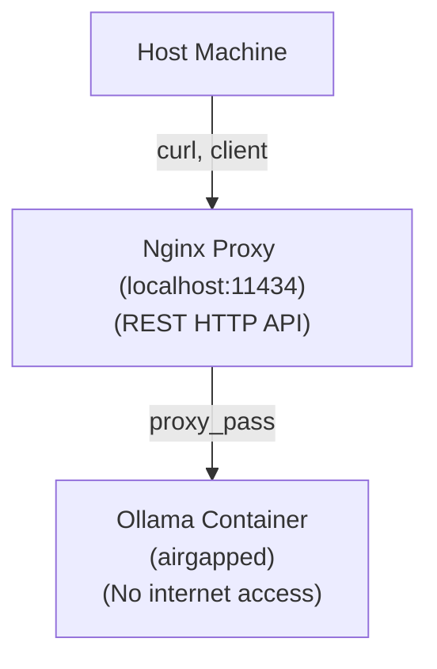

# Ollama Airgapped Setup

## Privacy & Security First

This setup ensures **maximum privacy and security**: your Ollama container is fully airgapped (no internet access), so your models and data never leave your machine. You must download models manually and provide them to the container. This approach guarantees that no external service can access your models or prompts.

---

## Architecture Overview

> **Note:** The Ollama API is a REST HTTP API, accessible via standard HTTP requests (e.g., with curl or any HTTP client).



---

## Initialization Steps

### 1. Install Ollama Locally (on your host)
- Download and install Ollama from [https://ollama.com/download](https://ollama.com/download) for your OS.
- Use Ollama to download the models you want, for example:
  ```sh
  ollama pull codellama
  ollama pull deepseek-coder
  ```

### 2. Locate Your Local Ollama Models Directory
- **Linux/macOS:**
  - `~/.ollama/models`
- **Windows:**
  - `%USERPROFILE%\.ollama\models`

**Important:**
> After downloading your models, make sure to **stop or kill the local Ollama service** before starting the Docker container. Running both at the same time on the same port (11434) will cause conflicts.
> 
> - On Linux/macOS, you can usually stop Ollama with:
>   ```sh
>   pkill ollama
>   # or, if running as a service
>   systemctl stop ollama
>   ```
> - On Windows, quit Ollama from the system tray or Task Manager.

### 3. Find the Docker Volume Mountpoint
- Run the following command to get the path to the Docker volume used by the container
  Your dir name is the first part of volume name (in example project dir is "local_llm" -> "dir_name_volume_name")
  Example:
  ```sh
  docker volume inspect local_llm_ollama_models
  ```
- Look for the `Mountpoint` field in the output, e.g.:
  ```json
  "Mountpoint": "/var/lib/docker/volumes/local_llm_ollama_models/_data"
  ```

### 4. Copy Your Downloaded Models to the Docker Volume
- Copy all contents from your local models directory to the Docker volume mountpoint. For example:
  ```sh
  # On Linux/macOS (adjust paths as needed)
  cp -r ~/.ollama/models/* /var/lib/docker/volumes/local_llm_ollama_models/_data/
  # On Windows (using PowerShell, adjust paths as needed)
  Copy-Item "$env:USERPROFILE\.ollama\models\*" \\wsl$\docker-desktop-data\version-pack-data\community\docker\volumes\local_llm_ollama_models\_data\ -Recurse
  ```

### 5. Start the Ollama Container
- From your project directory:
  ```sh
  docker compose up -d
  ```

---

## Test Your Setup

After starting the container, you can verify that Ollama is serving the API by running:

```sh
curl http://localhost:11434/api/tags
```

You should see a JSON response with the available models.

## Notes
- The container will only serve models that are present in the Docker volume.
- You can repeat steps 1–4 to add more models at any time.
- This setup ensures **no model or prompt data ever leaves your machine**. 